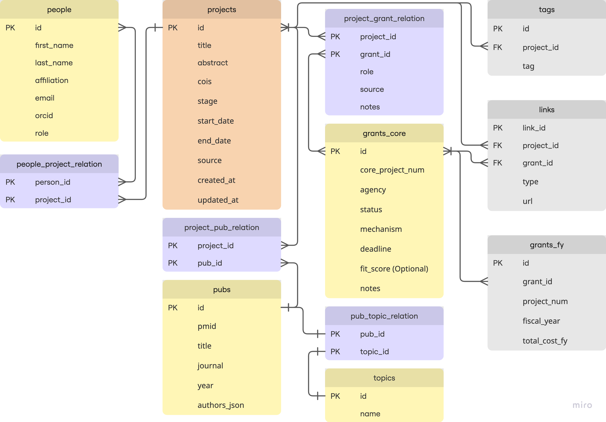
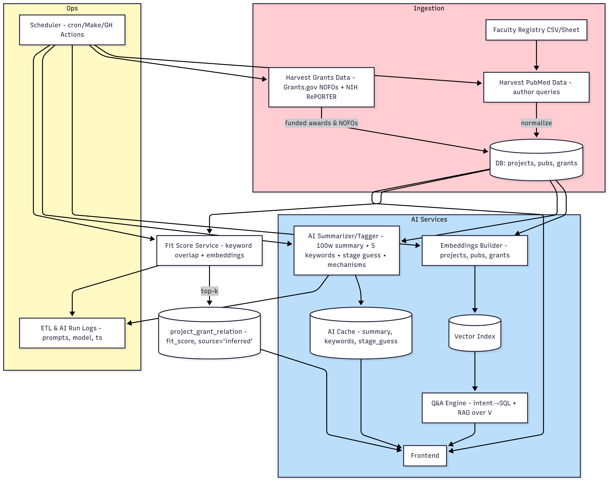

# AI-Orchestrated Research Project Tracker

Quick start:
1. `pip install -r requirements.txt`
2. `cp config/.env.sample .env`
3. Run ETL scripts in `etl/`
4. Launch Streamlit app in `app/streamlit_app.py`

## Environment Setup
### 1. Clone Repository
```bash
git clone <repo-url>
cd <repo-folder>
```
### 2. Create Conda Environment
```bash
conda create -n ai-research-tracker python=3.11 -y
conda activate ai-research-tracker
```
### 3. Install Environment
```bash
pip install -r requirements.txt
```

## Database Schema
Originally Proposed Version:
* projects(project_id, title, abstract, pi, cois, keywords, stage, start_date, end_date, source, created_at, updated_at)
* people(person_id, name, affiliation, email, orcid, role) 
* pubs(pub_id, project_id, pmid, title, journal, year, authors_json) 
* grants(grant_id, project_id, agency, mechanism, url, deadline, fit_score, notes)
* links(link_id, project_id, type, url) 
* tags(project_id, tag)
* Indexes: projects(title), pubs(pmid), grants(deadline), tags(tag)

Refined Version (Sep 25):


## Database Setup (SQLite)

This project uses SQLite for a lightweight prototype database.
**Create the DB:**
```bash
sqlite3 tracker.db < etl/schema.sql
# or
cd etl
python init_db.py

# inspect db (run under the parent folder)
sqlite3 tracker.db ".tables"
sqlite3 tracker.db "SELECT * FROM projects LIMIT 5;"
```

## Project Workflow (Mermain Data Pipeline Diagram)
